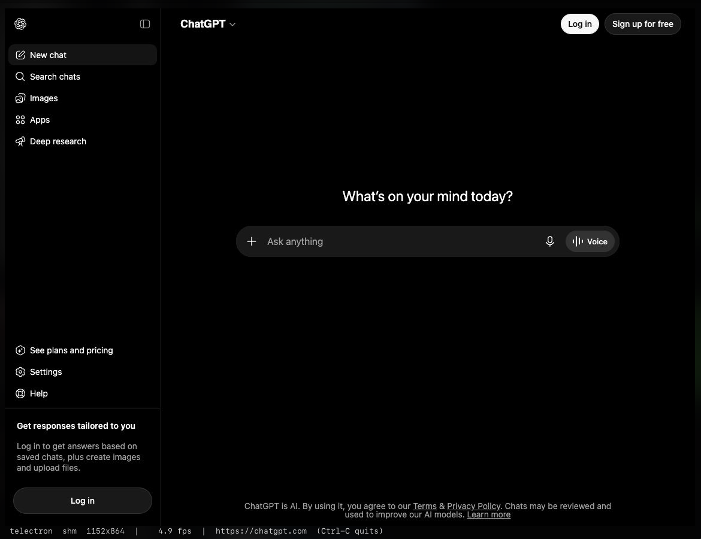

# telectron

A real, interactive headless **Chromium rendered inside your terminal** — pixels
drawn with the Kitty graphics protocol, mouse and keyboard fed straight back into
the page.



```sh
go build -o telectron . && ./telectron https://news.ycombinator.com
```

Chromium paints offscreen, frames stream over the Chrome DevTools Protocol and
land in the terminal flicker-free; your clicks and keystrokes get injected back
into the page. Quit with `Ctrl-C`. Run `telectron -h` for the flags.

Needs a Kitty-graphics terminal (Kitty, Ghostty, …) and Chrome/Chromium installed.

## Status

Mostly a **throwaway for-fun project** — a "can it actually work?" experiment that
happened to work. Expect rough edges, no roadmap, no promises. Hack on it, break
it, enjoy it.
